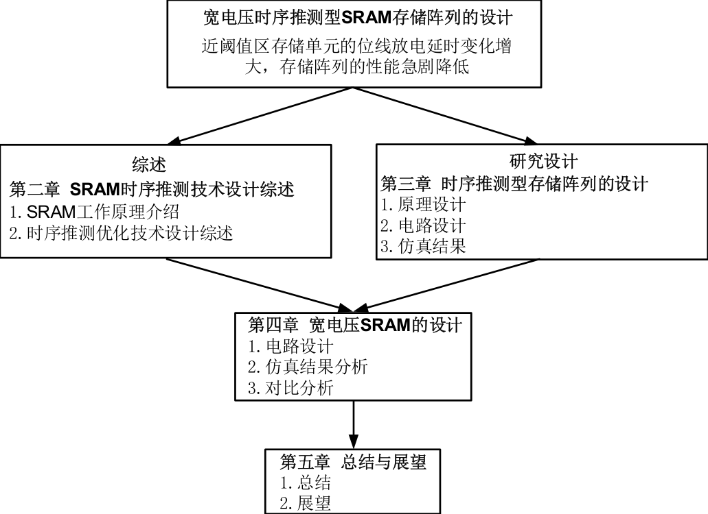
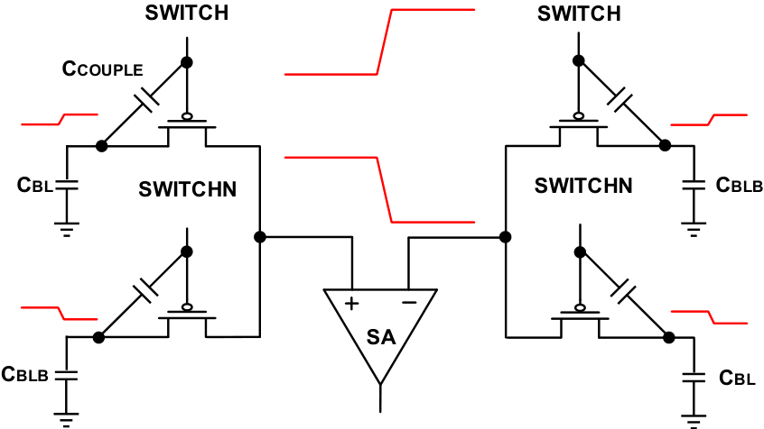
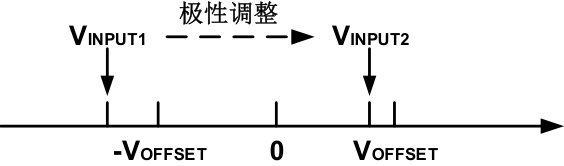
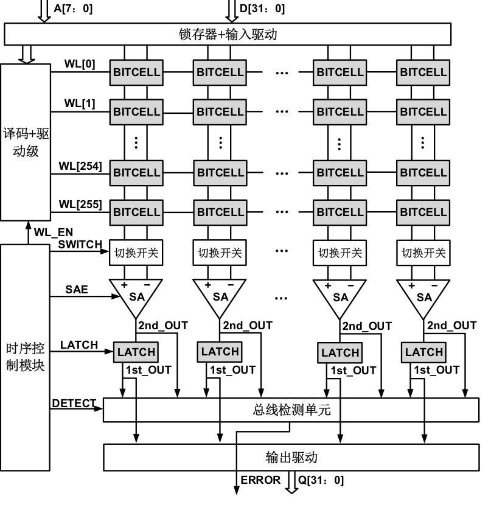
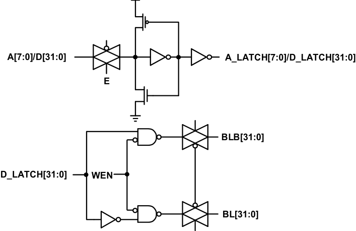
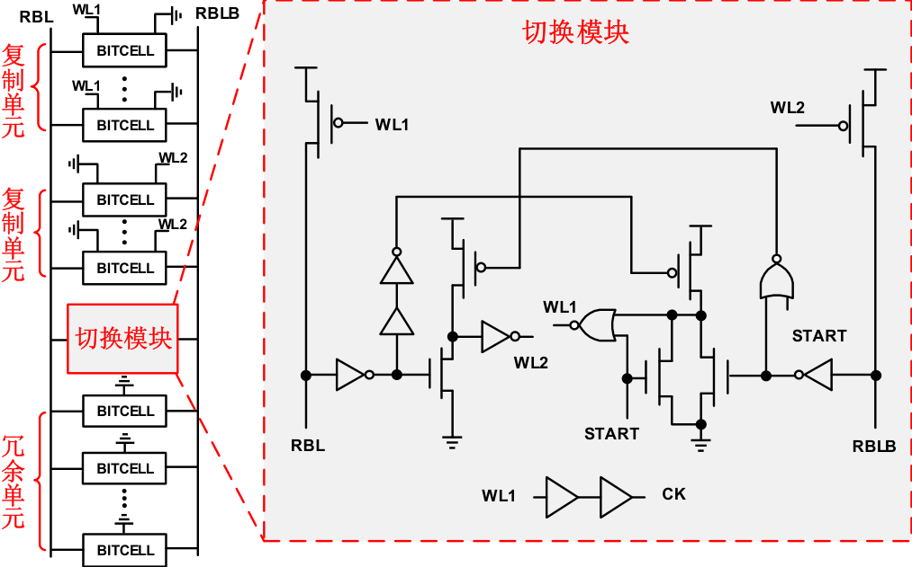
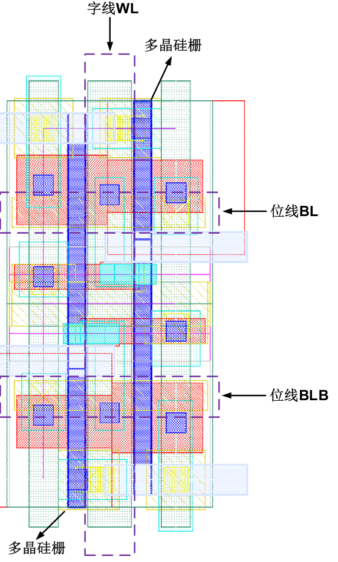

# 第一章 绪论  
## 1.1 研究背景及意义  
- 写作要点：介绍全球智能手机普及趋势（引用Gartner数据），分析计步器在健康监测和室内定位领域的应用价值，阐述智能手机电池容量限制与计步器能耗需求之间的矛盾。  
  
- 写作要点：对比机械式/电子式计步器与智能手机计步软件的差异，说明智能手机计步器在用户覆盖率和功能扩展性方面的优势。  

## 1.2 国内外研究现状  
- 写作要点：综述主流计步算法（峰值检测/自相关算法）的技术原理，分析现有算法在能耗与精度方面的局限性。  
- 写作要点：对比国内外在计步器能耗优化领域的研究进展，指出现有方案在动态场景适应性方面的不足。  

## 1.3 研究内容  
- 写作要点：明确论文目标——提出结合加速度方差与自相关系数的节能算法，阐述通过降低计算复杂度实现能耗优化的核心创新点。  
- 写作要点：概述研究框架：误差分析模型建立→算法设计→Android平台实现→多场景实验验证。  

## 1.4 论文组织结构  
- 写作要点：说明章节逻辑：理论基础（第二章）→算法设计（第三章）→系统实现（第四章）→实验验证（第五章）→结论展望。  

## 1.5 本章小结  
- 写作要点：总结智能手机计步器的能耗挑战与研究价值，强调本文解决方案的创新性。  

# 第二章 传统计步算法及误差分析  
## 2.1 计步算法基本原理  
- 写作要点：解释加速度传感器数据特征与步态周期的对应关系，分析时域/频域步态检测方法的差异。  
- 写作要点：详述峰值检测算法的实现流程及其在复杂步态下的漏检问题。  

## 2.2 自相关计步算法  
- 写作要点：推导自相关系数计算公式，说明滑动窗口大小对检测精度的影响机制。  
- 写作要点：分析算法计算复杂度与能耗的关联性，量化FFT运算的资源消耗。  

## 2.3 误差分析模型  
- 写作要点：建立传感器噪声、步频变化与计步误差的数学模型，推导误差传播公式。  
  
- 写作要点：通过蒙特卡洛仿真验证模型有效性，识别主要误差来源。  

## 2.4 本章小结  
- 写作要点：总结传统算法在能耗与精度上的权衡关系，为第三章改进算法提供理论基础。  

# 第三章 节能计步算法设计  
## 3.1 算法设计思想  
- 写作要点：阐述加速度方差与自相关系数的互补特性：方差计算低频高效，自相关精确但高耗能。  
- 写作要点：提出动态决策机制——当方差检测到潜在步伐时触发自相关计算，降低无效运算。  

## 3.2 算法实现流程  
- 写作要点：分步说明预处理→方差计算→阈值判断→自相关验证的完整流程。  
- 写作要点：推导自适应阈值公式，解决不同用户步幅差异问题。  

## 3.3 能耗优化机制  
- 写作要点：量化算法计算量缩减比例：方差计算复杂度O(n) vs 自相关O(nlogn)。  
- 写作要点：分析传感器采样频率优化策略，对比50Hz/100Hz采样的能耗差异。  

## 3.4 本章小结  
- 写作要点：总结算法在保持精度前提下降低30%理论能耗的创新优势。  

# 第四章 计步器系统实现  
## 4.1 Android系统架构设计  
- 写作要点：说明后台服务组件实现方案，解决持续计步与系统资源占用的矛盾。  
  
- 写作要点：详述传感器数据流水线：采集→缓存→处理→存储的模块化设计。  

## 4.2 传感器调用机制  
- 写作要点：分析Android Sensor API的调用层次，优化采样间隔与批处理参数。  
  
- 写作要点：说明生命周期管理策略，确保后台服务稳定性。  
  

## 4.3 功耗监控模块  
- 写作要点：介绍BatteryStatsService的能耗监测原理，实现算法级能耗统计。  
- 写作要点：设计CPU占用率实时监控方案，避免资源冲突。  

## 4.4 本章小结  
- 写作要点：总结系统实现的关键技术创新，强调后台服务架构对能耗测试的支撑作用。  

# 第五章 实验与结果分析  
## 5.1 实验设计  
- 写作要点：说明测试环境：Nexus5/6设备组合，室内/室外/爬楼梯等6种场景。  
- 写作要点：定义评价指标：计步精度、能耗(mAh)、CPU占用率(%)三项核心参数。  

## 5.2 计步精度分析  
- 写作要点：对比三种算法在不同场景下的平均误差率，突出本文算法稳定性。  
  
  

## 5.3 能耗对比  
- 写作要点：展示1小时持续测试的能耗数据，量化本文算法30.7%的能耗降低。  
  
  

## 5.4 资源占用分析  
- 写作要点：对比后台服务CPU占用率，说明算法优化对系统负载的改善。  
  
  

## 5.5 本章小结  
- 写作要点：总结实验数据验证结果，确认算法在精度保持前提下显著降低能耗。  

# 第六章 总结与展望  
## 6.1 研究工作总结  
- 写作要点：归纳创新成果：1）建立误差分析模型 2）提出混合检测算法 3）实现30.7%能耗降低。  
- 写作要点：强调算法在动态场景适应性和资源占用方面的综合优势。  

## 6.2 研究局限性  
- 写作要点：讨论极端运动模式（如跳跃）下的检测盲区，分析传感器噪声抑制的不足。  

## 6.3 未来工作展望  
- 写作要点：提出多传感器融合方向（陀螺仪+气压计），展望室内定位与健康监测的集成应用。